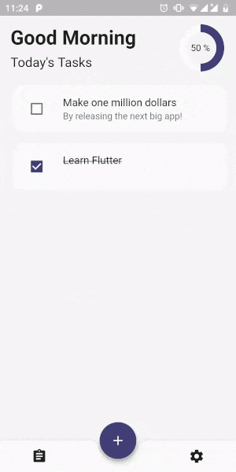
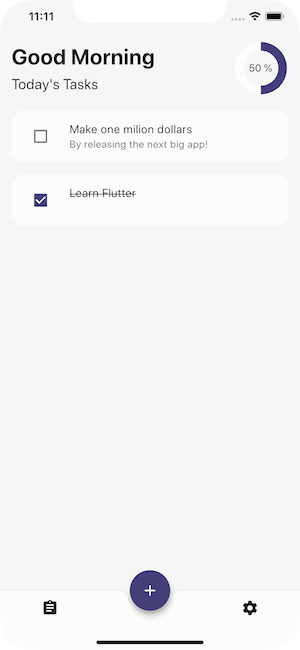
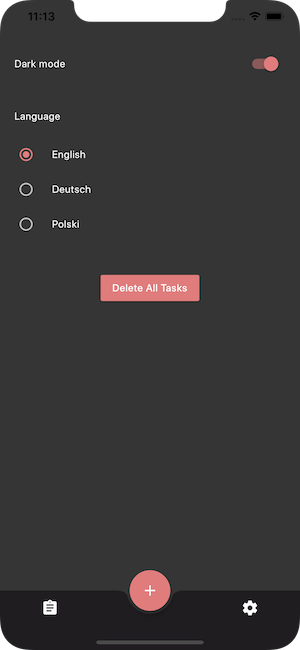

# todo

A Flutter project where the user can keep track of their todos.

Design inspired by [To Do App | Light / Dark Mode 🌑🌕](https://dribbble.com/shots/8294981-To-Do-App-Light-Dark-Mode) by [Sveta Tumanova](https://dribbble.com/sielurii).

## Screenshots

|                     |                              |                              |                              |                              |
| --------------------| ---------------------------- | ---------------------------- | ---------------------------- | ---------------------------- |
|  |  |  |  |  |

## Technical Info

- The app consists of a single screen `HomeScreen` with two tabs `TaskScreen` and `SettingsScreen`.
- A floating action button is used to show `CreateTaskSheet`.
- The app supports both light and dark mode.
- A greeting is displayed to the user depending on the time of day.
- The app is localized into three languages: English, German and Polish.
- `CustomPainter` is used to draw a chart illustrating the percentage of completed tasks. `AnimatedBuilder` is used to animate this chart.
- Hive is used to store all tasks and user settings to the device.
- `Provider` is used for dependency injection.
- `MobX` is used as the project's state management solution.
